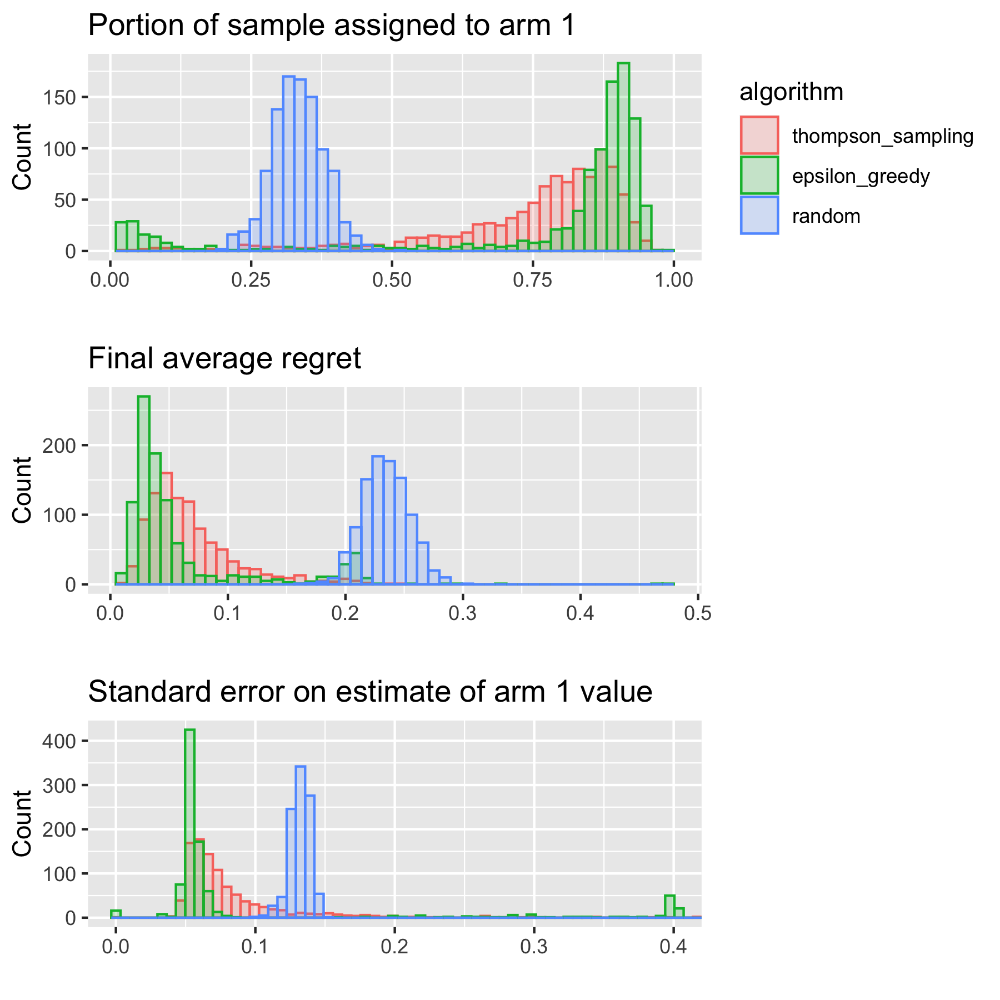

```{=html}
<style>
div.blue { background-color:#e6f0ff; border-radius: 5px; padding: 20px;}
</style>
```
```{=html}
<style>
div.medblue { background-color: #b3d1ff; border-radius: 5px; padding: 5px;}
</style>
```
```{=html}
<style>
div.darkblue { background-color: #9ac2ff; border-radius: 5px; padding: 5px;}
</style>
```
## Learning Objective

In this tutorial, you will learn about methods for designing and
analyzing adaptive experiments.

#### Load packages

```{r setup, echo=FALSE}
knitr::opts_chunk$set(echo = TRUE, warning = FALSE, message = FALSE, comment = NA)
# Clear workspace
rm(list = ls())
options(digits = 4)
```

```{r load_packages}
# Use standard library calls for shiny loading
library(bandit) # runs Bernoulli Thompson sampling
library(shiny) # to run interactive examples
library(knitr) # formatting tables
library(kableExtra) # formatting tables
library(ggplot2) # plotting
library(reshape2) # reshaping
library(gridExtra) # tables

source("bernoulli_bandit_utils.R")
source("regret_experiment.R")
source("bias_stderr_experiment.R")
```

```{r shiny_app_setup, echo=FALSE}
set.seed(94305) # Set seed for reproducibility
```

## **0. Adaptive experimentation**

::: medblue
##### Why experiment adaptively?
:::

Imagine that we have a set of possible interventions, and we would like
to say something about their expected outcomes in a population of
interest. For example, we could be researchers trying to find out which
medical treatment leads to better health outcomes among a particular
class of people. Or we could be web designers who would like to know
which web page format leads to more user engagement. In any of these
examples, we could learn about the performance of each intervention (or
"treatment arm" as we will call them from now on) by drawing a certain
number of individuals from the population of interest and running an
experiment. In this tutorial, you will learn a few important
considerations when designing such an experiment.

The simplest and most straightforward way of running an experiment is by
using a standard randomized experimental design, sometimes also called a
*randomized control trial* (RCT) or A/B testing. In standard randomized
experiments, we select a predetermined number of experimental subjects
from our population, and each subject is assigned each of the treatment
arms with equal probability. For example, if we have three possible
medical treatments, then each person has a one-third chance of receiving
each one of these treatments.

RCTs have several advantages. They are easy to implement and explain to
possible stakeholders, and (as you will see later in this tutorial) it
is relatively easy to analyze their results, compared to more complex
designs.

However, imagine that after a randomized control trial, we found out (as
we had hoped to find) that some treatment arms indeed lead to better
outcomes. To continue the web design example, perhaps we discovered that
one of our web page prototypes elicited much more engagement than
others. On the one hand, we are happy to have made a discovery. On the
other hand, we also incurred two kinds of loss. First, we did force some
of our experimental subjects to use the less engaging prototypes, and
perhaps lost some clients along the way. Second, because the number of
subjects receiving the best treatment arms was just as large as the
number receiving treatment from the inferior arms, we learned the same
amount about the former (which we are interested in) as we do about the
latter (which we are not).

In other words, although we are *not* interested in the treatment arms
that don't perform well, the RCT design forced us to waste a lot of our
sample on sub-optimal treatments. In a sense we'll formalize below, we
experience *regret*.

The objective of this tutorial is to suggest strategies to minimize
these losses by discovering which are the most promising treatment arms
*during the experiment*, and then targeting those arms by assigning them
to more experimental subjects. This way, fewer individuals receive the
sub-optimal treatment arms, and we learn more about the optimal ones.

::: blue
##### Regret

One of the metrics we will consider when comparing algorithms is
*regret*. Regret is the difference between the average outcomes we
*would have* observed under optimal assignment and the average outcomes
we *actually* observe under a given assignment algorithm. To continue
the web design example just a little further, if the best prototype
gives us a 90% click-through rate on average, and a different prototype
gives us a 40% rate on average, then the *regret* from assigning the
sub-optimal arm is 0.5.

Consequently, a *low* average regret means that the algorithm is getting
closer to optimal performance. Of course, this isn't a metric we can
measure in applied settings, because we never know the truly optimal
values. But it helps us compare performance of different algorithms in
simulated settings.

One of the reasons we might want to focus on minimizing regret--instead
of, say, maximizing outcomes--is that the smallest possible regret is
always zero, regardless of the underlying outcome distribution, whereas
largest possible outcomes are dependent on the setting.
:::

If we knew ex ante which version of treatment was best on average, we
would simply assign that treatment to all subjects. But since we do not,
we design an adaptive experiment to both learn something about all of
the treatment conditions (that is, to *explore* the outcome space), as
well as to over-assign treatment to the arm (or arms) that appears to
have the best performance (that is, to *exploit* the best arm) based on
our observations.

Below, we'll consider an experimental setting with three experimental
treatment arms and two hypothetical designs. In the first design, we
randomize treatment and assign each arm with equal probability. In the
second design, we use an adaptive algorithm where we change our
treatment assignment probabilities over time. We'll discuss several such
algorithms in the following section.

The true arm means are 0.8, 0.6, and 0.3, for arms 1, 2, and 3
respectively. These could be the click-through rates from our web design
example.

-   **Notice what happens to assignment probabilities** In the random
    experiment, assignment probabilities stay at 0.33 throughout the
    experiment. In the adaptive experiment, we're assigning the best arm
    (arm 1) with 75% probability by the end of the experiment.

-   **Notice what happens to average regret.** In the random experiment,
    average regret stays fairly flat throughout the experiment. In the
    adaptive experiment, we are able to reduce average regret over time.

***Random experiment, with balanced assignment probabilities
throughout:***

```{r regret1, echo = FALSE}
mean_vals <- c(0.8, 0.6, 0.3)
ylims <- c(0, max(abs(diff(range(mean_vals)))))
N <- 100 # experiment size

results <- list()
results[[1]] <- run_bernoulli_experiment(
  means = mean_vals,
  algorithm = "random",
  T = N
)
p_assign <- plot_assignment_probabilities(results)

K <- ncol(results[[1]]$e)
df <- do.call(
  rbind,
  mapply(function(r, i) {
    data.frame(factor(i), 1:nrow(r$e), r$e)
  }, results, seq_along(results),
  SIMPLIFY = F
  )
)
colnames(df) <- c("id", "time", seq(K))
df <- melt(df, id.vars = c("id", "time"), variable.name = "arm")

p_assign <- ggplot(df, aes(x = time, y = value)) +
  geom_line(aes(group = id)) +
  facet_wrap(. ~ arm, nrow = ceiling(K / 3)) +
  xlab("time") +
  ylab("") +
  coord_cartesian(ylim = c(0, 1)) +
  ggtitle("Assignment probabilities")

df <- do.call(
  rbind,
  lapply(
    results,
    function(r) {
      data.frame(1:length(r$regret), r$regret)
    }
  )
)
colnames(df) <- c("time", "regret")
df <- melt(df, id.vars = c("time"), variable.name = "regret")
p_regret <- ggplot(df, aes(x = time, y = value)) +
  coord_cartesian(ylim = ylims) +
  geom_line() +
  geom_hline(yintercept = .25, linetype = "dashed", color = "grey") +
  xlab("time") +
  ylab("") +
  ggtitle("Average regret")

grid.arrange(p_assign, p_regret,
  layout_matrix = rbind(c(1), c(2))
)
```

***Adaptive experiment, updating treatment assignment probabilities
based on observed outcomes:***

```{r regret2, echo = FALSE}
results <- list()
results[[1]] <- run_bernoulli_experiment(
  means = mean_vals,
  algorithm = "thompson_sampling",
  T = N,
  floor = 0.025
)

df <- do.call(
  rbind,
  mapply(function(r, i) {
    data.frame(factor(i), 1:nrow(r$e), r$e)
  }, results, seq_along(results),
  SIMPLIFY = F
  )
)
colnames(df) <- c("id", "time", seq(K))
df <- melt(df, id.vars = c("id", "time"), variable.name = "arm")

p_assign <- ggplot(df, aes(x = time, y = value)) +
  geom_line(aes(group = id)) +
  facet_wrap(. ~ arm, nrow = ceiling(K / 3)) +
  xlab("time") +
  ylab("") +
  coord_cartesian(ylim = c(0, 1)) +
  ggtitle("Assignment probabilities")

df <- do.call(
  rbind,
  lapply(
    results,
    function(r) {
      data.frame(1:length(r$regret), r$regret)
    }
  )
)
colnames(df) <- c("time", "regret")
df <- melt(df, id.vars = c("time"), variable.name = "regret")
p_regret <- ggplot(df, aes(x = time, y = value)) +
  coord_cartesian(ylim = ylims) +
  geom_line() +
  geom_hline(yintercept = .25, linetype = "dashed", color = "grey") +
  xlab("time") +
  ylab("") +
  ggtitle("Average regret")

grid.arrange(p_assign, p_regret,
  layout_matrix = rbind(c(1), c(2))
)
```

In developing algorithms for adaptive treatment assignment, we face a
trade off in exploration vs. exploitation: if we spend too much time
exploring all of the different arms, we will have a lot of information
about the relative performance of the different arms, but we will have
assigned a large portion of our subjects to sub-optimal arms. However,
if we quickly reach conclusions about which arm is "best" and exploit
based on very little data, we also risk selecting an arm that is truly
sub-optimal but has over-performed early in our study just by chance.

### Benefits to adaptivity

::: blue
Algorithms for adaptive experiments help us to navigate trade offs.
Compared to experimental designs where treatment assignment
probabilities remain fixed, under adaptive experiments, we are able to
increase average outcomes, improve precision of estimates regarding
outcomes under the best arms, and boost power of targeted hypothesis
tests. However, these designs come with some additional challenges and
trade offs, which we will discuss here.
:::

Suppose we run the above experiment many times. In the figures below, we
see distributions of results over 1,000 runs, using three different
algorithms for treatment assignment: standard random assignment, and two
types of adaptive algorithms, Thompson sampling and Epsilon Greedy, both
discussed below. We see that under the adaptive algorithms, more of the
sample is assigned to the best arm, arm 1, and we're able to improve
average regret over the course of the experiment. We're also able to
estimate the value of the best arm more precisely.

In general, whether we see benefits from adaptivity will depend on a
number of factors, including the number of arms, their outcome
distributions, and the duration of the experiment. We also have to take
into account additional factors for estimation and inference, discussed
in further detail in below sections.

```{r benefits, echo = FALSE, fig.asp=1}
if (!file.exists("benefits.png")) {
  s <- 1e3

  results1 <- list()
  for (i in seq(s)) {
    results1[[i]] <- run_bernoulli_experiment(
      means = mean_vals,
      algorithm = "thompson_sampling",
      T = N,
      floor = 0.025
    )
  }


  results2 <- list()
  for (i in seq(s)) {
    results2[[i]] <- run_bernoulli_experiment(
      means = mean_vals,
      algorithm = "epsilon_greedy",
      T = N,
      floor = 0.025
    )
  }

  results3 <- list()
  for (i in seq(s)) {
    results3[[i]] <- run_bernoulli_experiment(
      means = mean_vals,
      algorithm = "random",
      T = N
    )
  }

  results <- c(results1, results2, results3)

  # best arm assignment
  df_correct <- do.call(
    rbind,
    mapply(function(r, i) {
      data.frame(factor(i), mean(r$w == which.max(mean_vals)), r$algorithm)
    }, results, seq_along(results),
    SIMPLIFY = F
    )
  )

  names(df_correct) <- c("id", "correct", "algorithm")

  gg_correct <- ggplot(df_correct, aes(x = correct, group = algorithm, col = algorithm, fill = algorithm)) +
    geom_histogram(alpha = 0.2, bins = 50, position = "identity") +
    xlab("") +
    ylab("Count") +
    ggtitle("Portion of sample assigned to arm 1")

  # standard error on estimate of best arm value
  df <- rbind(
    cbind(do.call(rbind, Map(ipw_statistics, results1)), algorithm = results1[[1]]$algorithm),
    cbind(do.call(rbind, Map(ipw_statistics, results2)), algorithm = results2[[1]]$algorithm),
    cbind(do.call(rbind, Map(ipw_statistics, results3)), algorithm = results3[[1]]$algorithm)
  )

  df_stderr <- df[which(df$arm == which.max(mean_vals) & df$variable == "stderr"), ]

  gg_stderr <- ggplot(df_stderr, aes(x = value, group = algorithm, col = algorithm, fill = algorithm)) +
    geom_histogram(alpha = 0.2, bins = 120, position = "identity") +
    xlab("") +
    coord_cartesian(xlim = c(0, 0.4)) +
    ylab("Count") +
    ggtitle("Standard error on estimate of arm 1 value") +
    theme(
      legend.text = element_text(color = "white"),
      legend.title = element_text(color = "white"),
      legend.key = element_rect(fill = "white")
    ) +
    scale_color_discrete(
      guide = guide_legend(override.aes = list(
        color = "white",
        fill = "white"
      ))
    )


  # average regret
  df_regret <- do.call(
    rbind,
    mapply(function(r, i) {
      data.frame(factor(i), r$regret[N], r$algorithm)
    }, results, seq_along(results),
    SIMPLIFY = F
    )
  )

  names(df_regret) <- c("id", "regret", "algorithm")

  gg_regret <- ggplot(df_regret, aes(x = regret, group = algorithm, col = algorithm, fill = algorithm)) +
    geom_histogram(alpha = 0.2, bins = 50, position = "identity") +
    xlab("") +
    ylab("Count") +
    ggtitle("Final average regret") +
    theme(
      legend.text = element_text(color = "white"),
      legend.title = element_text(color = "white"),
      legend.key = element_rect(fill = "white")
    ) +
    scale_color_discrete(
      guide = guide_legend(override.aes = list(
        color = "white",
        fill = "white"
      ))
    )

  g <- arrangeGrob(gg_correct, gg_regret, gg_stderr, nrow = 3) # generates g
  ggsave(file = "benefits.png", g, width = 6, height = 6)
}
```

```{r benefits_fig, out.width='90%', include=TRUE, fig.align="center", echo=FALSE}

```

<!-- ``Adaptive experimentation'' potentially encompasses a broad class of experimental designs, but here we use it specifically to refer to response adaptive randomized designs, where we determine treatment assignment probabilities based on historical observed outcomes.  -->

### Notation

We establish some common notation and definitions for this setting with
multiple treatments. We'll consider a hypothetical data set with $N$
observations. Each observation in our data set is indexed by $i$, and is
represented by:

-   $W_{i} \in \{1, \dots, K\}$: a variable indicating which of $K$
    treatment arms an individual was assigned
-   $Y_{i}^{obs} \in \mathbb{R}$: a real-valued variable indicating the
    observed outcome for that individual

We make use of the *potential outcomes* framework of Rubin (1974), and
define the following random variables:

-   $Y_{i}(1)$: the outcome unit $i$ would attain if they received
    treatment 1
-   $Y_{i}(2)$: the outcome unit $i$ would attain if they received
    treatment 2
-   $\dots$
-   $Y_{i}(K)$: the outcome unit $i$ would attain if they received
    treatment K

This results in a table of potential outcomes as produced below, where
black values ($Y_{i}(k)$) are the ones we observe, and grayed-out values
(<font color="lightgray">$Y_{i}(k)$</font>) are the ones we don't
observe.

|   $i$    |  $W_i$   |                $Y_{i}(1)$                 |                $Y_{i}(2)$                 | $\cdots$ |                $Y_{i}(K)$                 |
|:----------:|:----------:|:----------:|:----------:|:----------:|:----------:|
|    1     |    2     | <font color="lightgray">$Y_{1}(1)$</font> |                $Y_{1}(2)$                 | $\cdots$ | <font color="lightgray">$Y_{1}(K)$</font> |
|    2     |    K     | <font color="lightgray">$Y_{2}(1)$</font> | <font color="lightgray">$Y_{2}(2)$</font> | $\cdots$ |                $Y_{2}(K)$                 |
| $\cdots$ | $\cdots$ |                 $\cdots$                  |                 $\cdots$                  | $\cdots$ |                 $\cdots$                  |
|    N     |    1     |                $Y_{N}(1)$                 | <font color="lightgray">$Y_{N}(2)$</font> | $\cdots$ | <font color="lightgray">$Y_{N}(K)$</font> |

Using the potential outcome notation above, the observed outcome can
also be written as

$$Y_{i}^{obs} = \sum_{w = 1}^K 1\{W_{i} = w\} \times Y_{i}(w)$$

We denote $Y_{i}^{obs}$ simply as $Y_{i}$ from now on.

<!-- **[[Include independence and positivity assumptions?]]** -->

## **1. Overview of algorithms**

::: medblue
##### How do we assign treatment adaptively?
:::

There are a number of algorithms used to address the explore-exploit
trade off; here we consider several commonly-used algorithms to
determine treatment assignment:

-   **Thompson sampling**
-   **Epsilon Greedy**
-   **Upper Confidence Bound**

::: blue
##### An experiment

Suppose that we're running an experiment with a binary outcome
($Y_i \in \{0, 1\}$). (We will work with Binomial outcomes for
simplicity, but any of the methods in this tutorial can be applied for
outcomes of any type.) There are two treatment arms, and the (unknown)
true mean under the first arm is 0.7, and 0.4 under the second arm.
We'll call an observation a "success" if it is 1, and a "failure"
otherwise.

Let's say our experimental sample has 20 observations, and we'll collect
the data in two equally sized batches.

-   In the first period of 10 observations, we'll assign treatment to
    the two arms with equal probability.
-   We'll observe outcomes under the two arms from the first period.
-   Then we'll consider treatment assignment probabilities for the
    second period under different adaptive algorithms.
:::

```{r experiment1}
N <- 20 # experiment size
mean_vals <- c(0.7, 0.4) # true, unknown means
K <- length(mean_vals) # number of arms
ymat <- mapply(rbinom, n = N, size = 1, prob = mean_vals) # full potential outcomes matrix
# each row of the matrix represents a unique observation in our experiment
# each column of the matrix is associated with potential outcomes under a given treatment
# initialize vectors for observed outcomes and treatment assignment
yobs <- w <- rep(NA, N)
# initialize matrix to store treatment assignment probabilities
pmat <- matrix(nrow = N, ncol = K)
```

We first collect data randomly for the first period of 10 observations.

```{r first}
# index for first batch
first_batch <- seq(10)
# randomly assign treatment in the first batch; observe outcomes
pmat[first_batch, ] <- 1 / K
w[first_batch] <- apply(
  pmat[first_batch, ], 1,
  function(x) sample(K, size = 1, prob = x)
)
yobs[first_batch] <- ymat[cbind(first_batch, w[first_batch])]
# number of assignments to each arm in the first batch
trials <- sapply(seq(K), function(k) sum(w == k, na.rm = TRUE))
# number of successes under each arm in the first batch
successes <- sapply(seq(K), function(k) sum(yobs[w == k], na.rm = TRUE))
```

The table below shows treatment assignments, selected potential
outcomes, and observed outcomes, for the first 10 observations.

```{r data1, echo=FALSE}
dat <- data.frame(cbind(seq(10), w, ymat, yobs))[seq(10), ]
colnames(dat) <- c("i", "W", "Y1", "Y2", "Yobs")

dat[cbind(seq(10), ifelse(w[seq(10)] == 1, 4, 3))] <- ""

kable_styling(kable(dat, align = "l"), "striped", full_width = FALSE)
```

We compute the means and standard errors from the above data.

```{r summary1, echo = FALSE}
datsum <- rbind(
  mean = apply(dat[, c("Y1", "Y2")], 2, function(x) mean(as.numeric(x), na.rm = TRUE)),
  se = apply(dat[, c("Y1", "Y2")], 2, function(x) standard_error(na.omit(as.numeric(x))))
)
kable_styling(kable(datsum, align = "l"), "striped", full_width = FALSE)
```

### Thompson sampling

Thompson sampling is based on a Bayesian framework, under which we have
priors about the outcome distributions under each of the arms, we
observe data, and then we update our priors to form posterior
distributions. Based on these posterior distributions, we calculate the
posterior probability that each arm is best. We then assign treatment
according to that probability.

::: blue
The intuition behind this algorithm is that the more confident we are
that a given arm is best (based on the posterior distributions), the
more likely we are to assign treatment to that arm.

Thompson sampling takes into account our *uncertainty* about arm means:

-   When we have a lot of uncertainty about all of the arms, we will
    continue to explore to gain more data.
-   As we gain more certainty that a given arm is best, we will assign
    treatment to that arm with higher probability, and collect more
    sample under that treatment.
-   For arms that perform relatively poorly, we decrease treatment
    assignment probability, and sample from those arms drops.
:::

Let's assume we have a Uniform prior regarding the value of the means
under each of the arms; that is, before observing any data, we think
that all mean values between 0 and 1 are equally likely. The posteriors
then follow a Beta distribution.

***Aside:** Here our likelihood is a Binomial distribution, and the Beta
distribution is a conjugate prior for the Binomial distribution (recall
that the Uniform distribution is a special case of a Beta
distribution).*

We can integrate to get the posterior probability that each arm is best,
but we can also sample from these posterior distributions many times,
and find the portion of times that each arm had the highest value; we
take the latter approach below.

```{r thompson}
# Number of monte-carlo simulations
S <- 1000
# Approximate Thompson Sampling probabilities (i.e. prob. that each arm is maximal)
# 1) Sample from each of the posteriors S times: theta[k] ~ Beta(successes[k], failures[k])
draws <- replicate(S, rbeta(K, successes + 1, trials - successes + 1))
# 2) Check how many times w^th arm was maximal
argmax <- apply(draws, 2, which.max)
# 3) Tally up the probabilities
probs_ts <- table(cut(argmax, 0:K)) / S
```

In the second period, we would assign treatment according to the
respective probabilities for each arm: `r round(probs_ts, 2)`.

Assigning treatment according to these probabilities, this would result
in assignment of arms with the following frequencies in the next 10
observations:

```{r thompson_assignment}
# Draw from the Thompson sampling probabilities
w_ts <- sample(K, size = 10, prob = probs_ts, replace = TRUE)
table(w_ts)
```

**What if we had run this experiment many times?** The below figures
show different runs of the experiment in different colors. Smoothed blue
loesss curves with 95% confidence intervals in gray give us an idea of
average assignments across runs. For the first 10 observations, the
probabilities are always 0.5 for both arms. But we will see some
variation in treatment assignment probabilities for the second period
based on those first 10 observations.

```{r thompson_iter, echo = FALSE}
results <- list()
for (i in seq(15)) {
  results[[i]] <- run_bernoulli_experiment(
    means = mean_vals,
    algorithm = "thompson_sampling",
    T = N,
    floor = 0,
    num_batches = 2,
    initial_batch = 0
  )
}

p_assign <- plot_assignment_probabilities(results, color = TRUE) +
  ggtitle("Assignment probabilities, 2 periods")
p_assign
```

After observing the first batch of data, we'll tend to increase
treatment assignment probability for the good arm and decrease
assignment for the bad arm. But this isn't always the case--sometimes
we'll see more bad outcomes for the good arm, and more good outcomes for
the bad arm, just by chance.

However, suppose we extend our experiment to more periods, and we
continue to update based on the data we observe. We might have ended up
assigning a higher probability of treatment to the bad arm in the second
period. But once we observe more data, we'll re-calibrate. As we get
more and more data, we have more and more certainty about which arm is
best.

```{r thompson_iter2, echo = FALSE}
results <- list()
for (i in seq(15)) {
  results[[i]] <- run_bernoulli_experiment(
    means = mean_vals,
    algorithm = "thompson_sampling",
    T = N * 5,
    floor = 0,
    num_batches = 10,
    initial_batch = 0
  )
}

p_assign <- plot_assignment_probabilities(results, color = TRUE) +
  ggtitle("Assignment probabilities, 10 periods")
p_assign
```

### Epsilon Greedy

In the Epsilon Greedy algorithm, we identify which arm has the highest
mean outcome. We assign treatment to that arm in $(1-\epsilon)$ portion
of assignments, and assign treatment uniformly at random in the
remaining $\epsilon$ assignments.

Here, we'll set $\epsilon$ at 0.1

::: blue
The intuition behind this algorithm is that we're exploiting whichever
arm seems best, but we ensure that we'll keep assigning treatment and
getting observations under all of the arms with some probability. This
means that if we made a mistake early on, we can eventually collect
enough data to reverse course.

We do *not* account for our uncertainty here; if one arm performs a tiny
bit better or a lot better than the other arm, it makes no difference to
the algorithm.
:::

```{r epsilon}
greedy_arm <- which.max(successes / trials)
epsilon <- 0.1
probs_eg <- c(1 - epsilon, epsilon)
greedy <- sample(c(TRUE, FALSE), size = 10, prob = probs_eg, replace = TRUE)
w_eg <- ifelse(greedy, greedy_arm, sample(K, size = 10, replace = TRUE))
```

```{r greedy plot, fig.asp=.5, echo=FALSE}
df <- data.frame(
  Treatment = factor(c(1, 2)),
  Response = successes / trials
)
p <- ggplot(df, aes(Treatment, Response, color = Treatment))
p + geom_point() +
  theme(legend.title = element_blank()) +
  ylab("Mean Response") +
  ylim(c(0.25, 1)) +
  annotate(geom = "segment", x = 1.3, y = df$Response[1] + .05, xend = 1.05, yend = df$Response[1] + .01, arrow = arrow(length = unit(2, "mm"))) +
  annotate(geom = "segment", x = 1.7, y = df$Response[2] + .05, xend = 1.95, yend = df$Response[2] + .01, arrow = arrow(length = unit(2, "mm"))) +
  annotate(geom = "text", x = 1.33, y = df$Response[1] + .05, label = "Pick this one \n with prob = 0.95", hjust = "left") +
  annotate(geom = "text", x = 1.33, y = df$Response[2] + .12, label = "Remaining \n prob = 0.05", hjust = "left")
```

This means we assign treatment to the "best" arm with a probability of
0.9, and to the other arm with a probability of 0.1. Assigning treatment
according to these probabilities, this would result in assignment of
arms with the following frequencies in the next 10 observations:

```{r epsilon_assignmant}
table(w_eg)
```

***Aside:** Here, we've fixed the value of* $\epsilon$, but in practice,
we may want to allow it to decay as the sample grows larger, so we'll
assign the arm with the highest mean with increasing probability. In
simulations below, we'll use: $$
\epsilon = K \times 1 /  t^{\tau}
$$ *for* $t \in \{1, \dots, T\}$, where $\tau$ is the decay rate. The
default decay rate in simulations is 0.5.

**What if we had run this experiment many times?**

There are only two paths that we can take: we can pick the first arm as
best, and assign it with 0.95 probability in the second period; or we
can pick the second arm as best, and assign it with 0.95 probability in
the second period. The smoothed lines show that we generally correctly
select the best arm; but again, this is not always the case.

```{r epsilon_iter, echo = FALSE}
results <- list()
for (i in seq(10)) {
  results[[i]] <- run_bernoulli_experiment(
    means = mean_vals,
    algorithm = "epsilon_greedy",
    T = N,
    floor = 0,
    num_batches = 2,
    initial_batch = 0
  )
}

p_assign <- plot_assignment_probabilities(results, color = TRUE) +
  ggtitle("Assignment probabilities, 2 periods")
p_assign
```

We'll see what happens if we run this experiment over more periods as
well. As with Thompson sampling, the longer we run the experiment, the
more likely we are to assign the higher probability to the best arm. But
because this algorithm is *greedy*, when we pick the bad arm as best, we
assign it with a probability that is just as high as when we pick the
good arm as best; we do not account for any uncertainty about our
estimates.

```{r epsilon_iter2, echo = FALSE}
results <- list()
for (i in seq(25)) {
  results[[i]] <- run_bernoulli_experiment(
    means = mean_vals,
    algorithm = "epsilon_greedy",
    T = N * 5,
    floor = 0,
    num_batches = 10,
    initial_batch = 0
  )
}

p_assign <- plot_assignment_probabilities(results, color = TRUE) +
  ggtitle("Assignment probabilities, 10 periods")
p_assign
```

### UCB and other algorithms

There are many additional algorithms. Under one class of algorithms,
termed Upper Confidence Bound algorithms, we observe sample means under
each of the arms, and then we compute *uncertainty bounds* around each
of those estimates (note that these are *not* the same as confidence
intervals under a normal approximation). As we collect more data on a
given arm, the bounds become tighter around the mean.

Formally, we assign treatment to arm $k$ that maximizes, $$
\bar{x}_k + \sqrt{\frac{1 \ln n}{n_k}}
$$

::: blue
The intuition behind this algorithm is that we're focusing on reducing
uncertainty about the top of the distribution of mean outcomes.

For arms that are performing well or that we have a lot of uncertainty
about, the upper confidence bounds will be high. We will collect sample
from the arm with the highest upper confidence bound until the bound
shrinks enough so that it drops below the next highest upper confidence
bound. We will keep on doing this until we eventually settle on an arm
with a mean that is higher than the upper confidence bounds on the other
arms.
:::

```{r ucb plot, fig.asp=.5, echo=FALSE}
df <- data.frame(
  Treatment = factor(c(1, 2)),
  Response = successes / trials,
  upper = successes / trials + sqrt(1 * log(sum(trials)) / trials),
  lower = successes / trials - sqrt(1 * log(sum(trials)) / trials)
)
p <- ggplot(df, aes(Treatment, Response, color = Treatment))
p + geom_point() +
  geom_errorbar(aes(ymin = lower, ymax = upper), width = 0.2) +
  theme(legend.title = element_blank()) +
  ylab("Mean Response + \n Confidence Bound") +
  annotate(geom = "segment", x = 1.3, y = df$upper[1] - .3, xend = 1.1, yend = df$upper[1] - .05, arrow = arrow(length = unit(2, "mm"))) +
  annotate(geom = "text", x = 1.25, y = df$upper[1] - .4, label = "Pick this one", hjust = "left")
```

Unlike the first two algorithms, which are *probabilistic*, this
algorithm is *deterministic*, and so if we used this algorithm for all
treatment assignments in a given batch, we would assign all observations
to the same treatment.

Using this algorithm would result in assignment of arms with the
following frequencies in the next 10 observations:

```{r ucb}
ucb_arm <- which.max(successes / trials + sqrt(1 * log(sum(trials)) / trials))
w_ucb <- rep(ucb_arm, 10)
table(w_ucb)
```

**What if we had run this experiment many times?**

As with the Epsilon Greedy algorithm, there are only two paths that we
can take: we can pick the first arm as best, and assign it to all
observations in the second period, or we can pick the second arm as
best, and assign it to all observations in the second period. The
smoothed lines show that we generally correctly select the best arm; but
again, this is not always the case.

```{r ucb_iter, echo = FALSE}
results <- list()
for (i in seq(10)) {
  results[[i]] <- run_bernoulli_experiment(
    means = mean_vals,
    algorithm = "ucb",
    T = N,
    num_batches = 2,
    initial_batch = 0
  )
}

p_assign <- plot_assignment_probabilities(results, color = TRUE) +
  ggtitle("Assignment probabilities, 2 periods")
p_assign
```

We'll see what happens if we run this experiment over more periods as
well. Note that it looks a lot like the Epsilon Greedy experiments, but
the probabilities are more extreme.

```{r ucb_iter2, echo = FALSE}
results <- list()
for (i in seq(25)) {
  results[[i]] <- run_bernoulli_experiment(
    means = mean_vals,
    algorithm = "ucb",
    T = N * 5,
    num_batches = 10,
    initial_batch = 0
  )
}

p_assign <- plot_assignment_probabilities(results, color = TRUE) +
  ggtitle("Assignment probabilities, 10 periods")
p_assign
```

We won't focus on this algorithm further, because its deterministic
nature causes challenges for inference; our methods below rely on
treatment assignment probabilities that are strictly between 0 and 1 for
all treatment arms and all observations.

### Example

Try running experiments with different algorithms and parameter values,
below, and observe how average regret develops over time. In the below
simulations, we'll run experiments with 100 observations, where we
update the assignment probabilities after *every* observation. Each
simulation will produce 50 experiments, where the trajectory under each
experiment is represented by a light gray line. The blue line represents
a smoothed loess curve over the experimental runs.

1.  Run a set of random experiments and a set of adaptive experiments
    (either Thompson sampling or Epsilon-greedy). How does regret change
    over time in the two settings?
2.  What happens to sampling probabilities in the adaptive experiments
    when Prob[Y(1) = 1] and Prob[Y(2) = 1] are very close together? What
    about when they are very far apart?
3.  Set the Prob[Y(1) = 1] and Prob[Y(2) = 1] as equal and run any
    experiment. What happens to regret? Why?

```{r, echo = FALSE}
regret_experiment(num_sims = 50, height = 600)
```

## **2. Weighting estimators**

::: medblue
##### How do we get estimates of average outcomes under adaptive experiments?
:::

### Estimation

If we conduct inference on data collected using standard adaptive
algorithms without accounting for treatment assignment probabilities,
our estimates are biased. **This is because if an arm over-performs by
chance early in the experiment, we will likely collect more data on this
arm, and we'll have an opportunity to correct our estimate. If an arm
under-performs by chance, we are less likely to assign treatment to this
arm and consequently less likely to correct our estimate.**

::: blue
##### A toy example

To see how this works, consider a toy example, with two treatment arms,
1 and 2, each associated with mean outcomes of 0.5. In this toy example,
there are two periods.

-   **Period 1:** Assign treatment arm 1 and treatment arm 2 to *one
    subject each*. Observe outcomes.
-   **Period 2:** Assign treatment probabilistically to *one subject*
    using Thompson sampling.

This gives us three subjects total over two periods. We then estimate
sample means.
:::

```{r seed2, echo=FALSE}
set.seed(94306) # Set seed again, so that example doesn't change with edits above
```

```{r experiment2toy1}
mean_vals <- c(0.5, 0.5)
N <- 3
# observed outcomes and treatment assignment
yobs <- w <- rep(NA, N)
# treatment assignment probabilities
pmat <- matrix(nrow = N, ncol = K)
pmat[1:2, ] <- 1 / K # complete random assignment in first batch

# outcome matrix
ymat <- mapply(rbinom, n = N, size = 1, prob = mean_vals)
# assign treatment to one arm each in first period
w[1:2] <- 1:2
# observe outcomes
yobs[1:2] <- ymat[cbind(1:2, w[1:2])]
trials <- sapply(seq(K), function(k) sum(w == k, na.rm = TRUE))
successes <- sapply(seq(K), function(k) sum(yobs[w == k], na.rm = TRUE))

# assign probabilities for the new batch according to Thompson sampling
pmat[3, ] <- best_binomial_bandit(successes, trials)
```

##### Consider one run of this toy experiment:

In the first period:

```{r experiment2toydat, echo = FALSE}
dat2 <- data.frame(cbind(1:3, w, ymat, yobs, round(pmat, 2)))
colnames(dat2) <- c("i", "W", "Y1", "Y2", "Yobs", "Pr(W=1)", "Pr(W=2)")

dat2[cbind(1:2, ifelse(w[1:2] == 1, 4, 3))] <- ""
dat2[3, c(2:7)] <- " "

row_spec(kable_styling(kable(dat2, align = "l"), "striped", full_width = FALSE),
  1:2,
  bold = T, color = "white", background = "#9ac2ff"
)
```

Because we saw a 0 under arm 1, and a 1 under arm 2, we update the
posterior distributions with this data, and the probability that arm 2
is best is higher. Consequently, we give a higher treatment assignment
probability to arm 2.

```{r experiment2toydat2, echo = FALSE}
dat2[3, c(6:7)] <- round(pmat[3, ], 2)

row_spec(kable_styling(kable(dat2, align = "l"), "striped", full_width = FALSE),
  3,
  bold = T, color = "white", background = "#9ac2ff"
)
```

In the second period:

```{r experiment2toydat3, echo = FALSE}
# assign treatment based on assignment probabilities
w[3] <- sample(K, size = 1, prob = pmat[3, ], 2)
# observe outcomes
yobs[3] <- ymat[cbind(3, w[3])]

dat2 <- data.frame(cbind(1:3, w, ymat, yobs, round(pmat, 2)))
colnames(dat2) <- c("i", "W", "Y1", "Y2", "Yobs", "Pr(W=1)", "Pr(W=2)")

dat2[cbind(1:3, ifelse(w == 1, 4, 3))] <- ""

row_spec(kable_styling(kable(dat2, align = "l"), "striped", full_width = FALSE),
  3,
  bold = T, color = "white", background = "#9ac2ff"
)
```

We compute the sample means from the above data.

```{r summary2, echo = FALSE}
# Final numbers of trials and successes for each treatment arm
trials <- sapply(seq(K), function(k) sum(w == k, na.rm = TRUE))
successes <- sapply(seq(K), function(k) sum(yobs[w == k], na.rm = TRUE))

datsum <- rbind(mean = successes / trials)
colnames(datsum) <- c("arm1", "arm2")

kable_styling(kable(datsum, align = "l"), "striped", full_width = FALSE)
```

Here we only had three observations, but suppose we ran this toy
experiment many times.

```{r experiment2toy2}
iter <- 1000 # number of simulations
# initialize storage of estimates
sample_mean <- ipw_mean <- haj_mean <- matrix(nrow = iter, ncol = K)
sample_mean_best <- matrix(nrow = iter)
for (j in seq(iter)) { # simulate the experiment a number of times

  # outcome matrix
  ymat <- mapply(rbinom, n = N, size = 1, prob = mean_vals)
  # assign treatment to one arm each in first period
  w[1:2] <- 1:2
  # observe outcomes
  yobs[1:2] <- ymat[cbind(1:2, w[1:2])]
  trials <- sapply(seq(K), function(k) sum(w == k, na.rm = TRUE))
  successes <- sapply(seq(K), function(k) sum(yobs[w == k], na.rm = TRUE))
  # assign probabilities for the new batch according to Thompson sampling
  pmat[3, ] <- best_binomial_bandit(successes, trials)
  # assign treatment based on assignment probabilities
  w[3] <- sample(K, size = 1, prob = pmat[3, ])
  # observe outcomes
  yobs[3] <- ymat[cbind(3, w[3])]

  # Final numbers of trials and successes for each treatment arm
  trials <- sapply(seq(K), function(k) sum(w == k, na.rm = TRUE))
  successes <- sapply(seq(K), function(k) sum(yobs[w == k], na.rm = TRUE))
  sample_mean[j, ] <- successes / trials
  sample_mean_best[j] <- max(successes / trials)

  # IPW estimates (discussed below)
  ipw <- 1 / pmat[cbind(1:3, w)]
  ipw_mean[j, ] <- sapply(seq(K), function(k) sum((yobs * ipw / N) * (w == k)))
  haj_mean[j, ] <- sapply(seq(K), function(k) {
    sum((yobs * ipw / N) * (w == k) /
      (sum((ipw / N) * (w == k))))
  })
}
```

Over `r iter` simulations, the sample means are, on average,
`r round( colMeans(sample_mean), 3)`. But we know the *true* means are
0.5 for both arms, so we are seeing negative bias for means conditional
on each arm.

Yet, if we condition on the arm that we selected as best, the average
mean is `r round( colMeans(sample_mean_best), 3)`. So we see positive
bias for the "best" arm. (Even though we know both arms are identical!)
We'll address this problem in the next section.

::: blue
#### Inverse probability weighting

In the above example, if we saw a 0 from an arm in the first period,
holding fixed the other arm's outcome, we would give a *lower* treatment
assignment probability to that arm in the second period than if we had
seen a 1 from that arm. That means that our sample mean for that arm
from that experiment will likely just consist of that one observation.
When we average sample means across experimental runs, we are
**up-weighting** bad outcomes. If we saw a 1 from that arm in the first
period, we would give a *higher* treatment assignment probability to
that arm in the second period. That means that our sample mean for that
arm from that experiment will likely consist of the average of two
observations. That means that we are **down-weighting** good outcomes.
As a result, sample means will be downwardly biased.

A way that we can account for this bias is to use estimators that take
into account the treatment assignment probabilities. In particular, we
use **inverse-probability weighted (IPW) estimators, where we weight
each observation by the inverse of its probability of being assigned the
treatment it actually received**.

In our toy example, this means that we up-weight relatively rare events
(like seeing a second observation from an arm that produced a 0 in the
first period) and down-weight relatively common events (like seeing a
second observation from an arm that produced a 1 in the first period).
If we were running an experiment with large (equally sized) batches,
this means that even if we have different numbers of observations for a
given arm across periods, each period is weighted equally in calculating
the overall arm mean.

We define probability of treatment for observation $i$ as
$\pi_i(k;S_i) = \Pr[W_i = w|S_i]$, where $S_i$ represents the history of
treatment and outcomes prior to seeing observation $i$. (These are the
`Pr(W=1)` or `Pr(W=2)` from the table above, depending on which
treatment individual $i$ received; we include the conditioning because
across different runs of the experiment, individual probabilities will
be different.)

Then our IPW estimator for arm $k$ is: $$
\hat{\mu}^{ipw}(w) =\frac 1 N \sum_{i=1}^N Y_{i} \frac{ {1} \{W_i = w \}  }{\pi_{i}(w;S_i) }. 
$$ This estimator is finite-N unbiased for the mean.
:::

We will refer to individual "scores" as the contribution of each
observation to the weighted estimate, i.e., $$
\hat{\Gamma}_i(w) := Y_{i} \frac{ {1} \{W_i = w \}  }{\pi_{i}(w;S_i) }.
$$

For our single run of this experiment from above, then, we can augment
the table to include scores:

```{r scores2, echo = TRUE}
dat2$score1_ipw <- with(dat2, Yobs * (W == 1) / (`Pr(W=1)`))
dat2$score2_ipw <- with(dat2, Yobs * (W == 2) / (`Pr(W=2)`))
```

```{r scores2tab, echo = FALSE}
column_spec(kable_styling(kable(dat2, align = "l"), "striped", full_width = FALSE),
  8:9,
  bold = T, color = "white", background = "#9ac2ff"
)
```

<!-- Across simulations, our average IPW estimates of the arm means are `r round( colMeans(ipw_mean), 3)`; these estimates are unbiased.  -->

Variance of this estimator can be quite high, especially when some of
the the probabilities are quite small, and consequently, weights are
quite large. To account for this, we can use stabilized weights. (We can
also impose floors on treatment assignment probabilities, so
probabilities don't get too small. Probability floors can have
additional benefits; we discuss this further below.)

##### Stabilized weights

Also known as the Hájek estimator (Hájek, 1971), a stabilized IPW
estimator is normalized by the sum of the observed weights. This means
that if in a given experiment, there are a larger number of observations
with more extreme weights, the denominator is adjusted to account for
this and it can help keep the variance from becoming too extreme
(although it means that the estimator is no longer unbiased). It also
means that we get estimates that are bounded by the support of our data.
$$
\hat{\mu}^{haj}(w) =\frac{1}{N} \left( \sum_{i=1}^N Y_{i} \frac{ {1} \{W_i = w \}  }{\pi_{i}(w;S_i) }\right)/
\left( \frac{1}{N} \sum_{i=1}^N \frac{ {1} \{W_i = w \}  }{\pi_{i}(w;S_i) }\right)
$$ For our single run of this experiment from above, we now augment the
table to include stabilized scores:

```{r scores22, echo = TRUE}
dat2$score1_haj <- with(dat2, Yobs * (W == 1) / (`Pr(W=1)`) / sum(1 / N * (W == 1) / (`Pr(W=1)`)))
dat2$score2_haj <- with(dat2, Yobs * (W == 2) / (`Pr(W=2)`) / sum(1 / N * (W == 2) / (`Pr(W=2)`)))
```

```{r scores22tab, echo = FALSE}
column_spec(kable_styling(kable(dat2, align = "l"), "striped", full_width = FALSE),
  10:11,
  bold = T, color = "white", background = "#9ac2ff"
)
```

<!-- Across simulations, the average estimates are `r round( colMeans(haj_mean), 3)`. -->

Across simulations, our estimates are:

```{r scores23tab, echo = FALSE}

datsum <- rbind(
  sample_mean = colMeans(sample_mean),
  ipw_est = colMeans(ipw_mean),
  haj_est = colMeans(haj_mean)
)
colnames(datsum) <- c("arm1", "arm2")

kable_styling(kable(round(datsum, 3), align = "l"), "striped", full_width = FALSE)
```

The sample mean is negatively biased. The standard IPW estimates are
unbiased, but high variance. The stabilized IPW estimates are slightly
biased, but lower variance than the standard IPW estimates.

### Inference

To conduct inference, our estimated variance of the estimate is based on
the (corrected) sample variance of the scores:

$$
\hat{\textrm{V}}\left(\hat{\mu}(w)\right) :=\frac{1}{N (N-1) } \sum_{i = 1}^N \left(\hat{\Gamma}_i(w) - \hat{\mu}(w) \right)^2. 
$$

<!-- $$ -->

<!-- \hat{\sigma}^2(w) :=\frac{ \sum_{i = 1}^N h_i(w)^2 \left(\hat{\Gamma}_i(w) - \hat{\mu}(w) \right)^2}{ \left(\sum_{i = 1}^N h_i(w)\right)^2} -->

<!-- $$ -->

<!-- where the the $h_i$ terms are optional evaluations weights, and the individual scores $\hat{\Gamma}_i(w)$ refer to the IPW or stabilized IPW scores, discussed above.  -->

***Aside:** A form for the variance discussed in [Hadad et al.
2019](https://arxiv.org/pdf/1911.02768.pdf) replaces the 1/N factor with
evaluation weights*, a generalized weighting scheme that allows us to
take into account how our algorithm performs at different points in the
experiment--for example, accounting for weights that become increasingly
extreme as time goes on--ensuring that our estimator has nice
properties, so that we can apply central limit theorems.

### Example

Try running experiments with different parameter values, below, and
observe how estimates, bias, and standard errors compare across
weighting methods. In the below simulations, we'll run experiments with
100 observations, where we update the assignment probabilities after
every observation.

1.  If you run the experiment with the default parameter values, which
    arm has the most bias using the sample mean? Which arm has the least
    bias?
2.  Set Prob[Y(1) = 1] and Prob[Y(2) = 1] both at 0.75, and Prob[Y(3) =
    1] at 0.05. In the adaptive experiments, we should see the
    assignment probabilities for arm 3 go toward zero fairly quickly, so
    we should have very few observations. But we also have lower bias
    and variance compared to the other two arms. Why?
3.  Now move Prob[Y(2) = 1] up to 0.9. What happens to the bias of arm
    1? Even though the underlying value of arm 1 hasn't changed, why do
    we now see greater bias under the sample mean?

```{r shiny_bias_stderr, echo = FALSE}
bias_stderr_experiment(height = 600, floor = 0.01, statistics = c("estimate", "bias", "stderr"))
```

## **3. Hypothesis testing**

::: medblue
##### How do we design adaptive experiments when we care about conducting inference?
:::

We generally design experiments with a hypothesis in mind. For the web
design example, we might want to test the hypothesis that one of the
proposed page formats produces levels of user engagement that are higher
than the status quo.

We need to think about what our inferential targets are and what
hypotheses we'll be testing when we design an adaptive experiment.
Suppose we ran the below adaptive experiment using Thompson sampling:

```{r diff3, echo = FALSE}
results <- list()
results[[1]] <- run_bernoulli_experiment(
  means = c(0.6, 0.5, 0.4),
  algorithm = "thompson_sampling",
  T = 100,
  floor = 0.025,
  initial_batch = 0
)
# p_assign <- plot_assignment_probabilities(results)

K <- ncol(results[[1]]$e)
df <- do.call(
  rbind,
  mapply(function(r, i) {
    data.frame(factor(i), 1:nrow(r$e), r$e)
  }, results, seq_along(results),
  SIMPLIFY = F
  )
)
colnames(df) <- c("id", "time", seq(K))
df <- melt(df, id.vars = c("id", "time"), variable.name = "arm")

p_assign <- ggplot(df, aes(x = time, y = value)) +
  geom_line(aes(group = id)) +
  facet_wrap(. ~ arm, nrow = ceiling(K / 3)) +
  xlab("time") +
  ylab("") +
  coord_cartesian(ylim = c(0, 1)) +
  ggtitle("Assignment probabilities")


p_infer <- plot_inference(results,
  statistics = c("estimate", "stderr"),
  estimators = c("ipw", "haj")
)
p_dinfer <- plot_diff_inference(results,
  statistics = c("estimate", "stderr"),
  estimators = c("ipw", "haj")
)

grid.arrange(p_assign, p_infer,
  layout_matrix = rbind(c(1), c(2))
)

ipwmat <- ipw_diff_statistics(results[[1]])
hajmat <- haj_diff_statistics(results[[1]])

dat3 <- rbind(
  ipwmat[which(ipwmat$variable == "tstat"), -3],
  hajmat[which(hajmat$variable == "tstat"), -3]
)
colnames(dat3)[3] <- "t-statistic"
```

It looks like the first arm has the highest mean, but how would we test
this? Formally, we could say that our null hypothesis is that all the
arms are equal, and we could propose an alternative hypothesis that a
given arm has the highest value: $$
H_{0}: \mu(w) = \mu(w')  \ \ \ \ H_{a}:  \mu(w)> \mu(w') \text{, for all } w' \neq w
$$ To test this, we would compare arm 1 against arms 2 and 3 separately.
If we reject the hypotheses that $\mu(1) = \mu(2)$, and the hypothesis
that $\mu(1) = \mu(3)$, then we would say the "global" hypothesis that
all arms are equal is rejected as well. We do not need to account for
multiple hypothesis testing.

```{r diffstat3, echo = FALSE, fig.asp = 0.4}
# p_dinfer
dat3 <- dat3[order(dat3$arm), ]
rownames(dat3) <- NULL
```

Considering the differences, we see that we do not get t-statistics that
allow us to reject the null hypothesis at conventional statistical
levels.

```{r tstat3, echo=FALSE}
kable_styling(kable(dat3, align = "l"), "striped", full_width = FALSE)
```

But it's not necessarily obvious that the design we used is going to be
helpful in testing this hypothesis:

-   We end up assigning higher probability of treatment to arm 1, and
    consequently we'll get more data about that arm, and we'll get a
    more precise estimate of its mean.
-   But we *do not* get very precise estimates of outcomes under arms 2
    and 3, and so we're not well powered to make comparisons across
    arms.

**Because adaptive algorithms may assign more treatment to the best arm,
they can disadvantage us when we wish to make comparisons across arms.**

### Accounting for a control condition

In randomized control trials, we often want to estimate the effect of
treatment relative to a control condition.

Let's set the control arm as $w = 3$. Suppose we wish to test a
hypothesis that the best version of treatment has a higher value than
the control arm. <!-- $$ -->
<!-- H_{0}: \mu(w_{best}) = \mu(0)  \ \ \ \ H_{a}:  \mu(w_{best}) > \mu(0) -->
<!-- $$ -->
<!-- To test this hypothesis, we would separately test the sequence of one-sided "local" hypotheses for each arm $w$. If one of these hypotheses is rejected, then we declare the "global" hypothesis rejected as well. Here we _do_ need to account for multiple hypothesis testing (see, e.g.,  [Dunnett, 1955](https://amstat.tandfonline.com/doi/abs/10.1080/01621459.1955.10501294?journalCode=uasa20#.Xnuc5pNKjOQ)) because we're comparing each of the arms separately to the control.  -->

Adaptive trials will help us in this setting with respect to treatment
assignment: we'll assign higher assignment probability to the best
performing arms.

But if we allocate assignment to the control arm using the adaptive
algorithms, we might have the sample problem we did above: the algorithm
might not assign much sample to the control condition, and we will be
under-powered for making comparisons to the control condition.

::: blue
To account for a control condition:

-   We could fix a portion of the experimental sample to allocate to the
    control arm, and conduct adaptive updating among the remaining
    treatment arms.
-   We may also use algorithms that adaptively update allocation to the
    control arm to match that assigned to the treatment arm with the
    highest mean (see e.g., [Offer-Westort et al.,
    2020](https://papers.ssrn.com/sol3/papers.cfm?abstract_id=3364402)).
:::

### Best arm learning and evaluation

We might want to compare the best version of treatment to other arms or
a control condition. But how do we know which arm is best?

Suppose you have two fair coins, and you want to estimate the
probability of getting heads under the "best" coin.

1.  You flip both coins a number of times.
2.  You take the average portion of times you got heads from each coin.
3.  You take whichever average is higher, and use that as your estimate.

This is going to give you a biased estimate--even though both coins were
fair.

A better approach would be to do steps 1 and 2 above, then:

3.  You take whichever average is higher, and select that coin as the
    "best" coin.
4.  *Then* flip that coin a number of times again, and only use these
    flips to get an estimate of its mean.

We are separating learning and evaluation, and we will do something
similar here, by learning which arm is best and estimating its value in
a rolling manner.
<!-- (_**Aside:** This holds if there is overlap in the distributions of the sample means. Consider: $\textrm{E}[\max(X_1, X_2, X_3)] \ge \max(\textrm{E}[X_1], \textrm{E}[X_2], \textrm{E}[X_3]$. Note that this occurs even if we use IPW estimators._)  -->

::: blue
We identify and evaluate the best treatment arm using the following
approach:

-   Let $t \in \{1, \dots, T\}$ represent time points in the experiment.
    At each point $t$ in the experiment, we calculate the value of each
    treatment arm $w$ as the average of scores $\hat{\Gamma}_i (w)$ up
    to time $t-1$. <!-- $$ -->
    <!-- \hat{\mu}_{t-1}(w)  := \frac{1}{t-1 } \sum_{s = 1 }^{t-1} \widehat{\Gamma}_{s}(w) -->
    <!-- $$ -->
-   The "best" treatment arm in period $t$ is the arm with the highest
    estimate: $$
    w^* =  \underset{w}{\arg\max} \ \hat{\mu}_{t-1}(w)
    $$
-   The score for the best arm in time $t$ is then the score in that
    period for the selected arm, $\widehat{\Gamma}_{t}(w^*)$
-   To evaluate the best arm, we take the average of the scores.

This approach gives us an unbiased estimate of a best treatment arm, as
in each time period we're conducting learning and evaluation separately.
However, note that the underlying treatment arm that is being evaluated
is itself random.
:::

We can then test the hypothesis that this "best" arm is superior to the
control condition. $$
H_{0}: \mu(w^*) = \mu(3)  \ \ \ \ H_{a}:  \mu(w^*) > \mu(3)
$$

### Example

Try running experiments with different designs, below, and observe how
estimates and standard errors compare across designs. In the below
simulations, we'll run experiments with 100 observations, where we
update the assignment probabilities after every observation. We will let
arm 1 be the fixed control arm.

1.  Try running the experiment with the control arm fixed at 1/K
    assignment, compared to the algorithmic default, for the adaptive
    algorithms (Thompson sampling and Epsilon-greedy). Compare the power
    and t-statistics. Which design gives us more power for comparing
    differences?
2.  Now run a random experiment. How do the power and t-statistics
    compare to the adaptive experiments.
3.  What if we're in a setting where there is no signal--i.e., all of
    the arms have the same underlying means? Set Prob[Y(1) = 1] =
    Prob[Y(2) = 1] = Prob[Y(3) = 1] = 0.5. How do the adaptive
    algorithms compare to the random algorithm?

```{r shiny_bias_stderr4, echo = FALSE}
bias_stderr_experiment_control(height = 700, floor = 0.025, statistics = c("estimate", "stderr", "tstat", "power"))
```

## **4. Instability and balancing**

::: medblue
##### How do we account for instability in adaptive experiments?
:::

One of the challenges with adaptive trials is that the algorithms can
come to different "conclusions" about which arm is best across runs of
the experiment, particularly when there is little or no signal.

In the below experiment, we run Thompson sampling over an experiment
with two arms for 100 observations. The true, underlying means for both
arms is 0.5. But across 20 runs of the experiment, we often end up
assigning very high or very low probability to one or the other of the
arms.

```{r assign4, echo = FALSE, fig.asp=0.5}
results <- list()
for (i in seq(20)) {
  results[[i]] <- run_bernoulli_experiment(
    means = c(0.5, 0.5),
    algorithm = "thompson_sampling",
    T = 100,
    floor = 0,
    initial_batch = 0
  )
}

p_assign <- plot_assignment_probabilities(results)
p_assign
```

### Balancing weights

As we saw above, our estimates produced under adaptive designs are
biased if we do not account for assignment probabilities. Similarly, the
adaptive algorithm may operate on a biased model; this can lead the
algorithm to make bad decisions and over-sample sub-optimal arms, or
become falsely confident when there is no true signal.

<!-- This can be due to mis-specified functional form of the outcome model, or, e.g., using standard Thompson sampling based on sample means without accounting for treatment assignment probability--we have noted above that sample means are biased for the true mean, so effectively our adaptive algorithm is learning based on biased estimates of our parameter. -->

<!-- Bandits can also be thrown off by initially biased data, e.g., a non-representative set of users in early batches. (See AAAI [paper](https://www.aaai.org/ojs/index.php/AAAI/article/view/4221/4099)). This is not uncommon in many use cases where we might see day-of-the-week effects, or other time trends/lack of stationarity.   -->

As an alternative, we can use a version of these algorithms with
*balancing weights* (see [Dimakopolou et al,
2017](https://arxiv.org/abs/1711.07077)).

::: blue
##### Thompson sampling with balancing weights

-   Using the weighting methods discussed above, predict outcome means
    and variances for each arm: $$
    \hat{\mu}(w), \  \hat{\textrm{V}}\left(\hat{\mu}(w)\right) \ \  \text{for all arms } w
    $$
-   Using the parameters estimated in the previous step, assume that the
    distribution of outcomes is approximately Normal under each arm: $$
    \sim \mathcal{N}\left(\hat{\mu}(w), \hat{\textrm{V}}\left(\hat{\mu}(w)\right)\right)
    $$ (Even if we believe our outcome follows a Binomial or other
    distribution, we can use a Normal approximation.)
-   Sample from each of these distributions many times, and find the
    proportion of times that each arm has the highest value. These
    proportions are the sampling probabilities in the next period.
:::

We return to the experiment from Part 1. Recalling our first 10
observations, we now calculate scores, $\hat{\Gamma}(1)$ and
$\hat{\Gamma}(2)$:

```{r experiment1_redux}
dat$`Pr(W=2)` <- dat$`Pr(W=1)` <- 1 / 2
dat$score1 <- with(dat, Yobs * (W == 1) / (1 / 2))
dat$score2 <- with(dat, Yobs * (W == 2) / (1 / 2))
```

```{r experiment1_reduxtab, echo=FALSE}
kable_styling(kable(dat, align = "l"), "striped", full_width = FALSE)
```

We would then follow the revised algorithm:

```{r bts}
# 0) predict outcome means and variances for each arm
muhats <- with(dat, c(mean(score1), mean(score2)))
N <- nrow(dat)
sigmahats <- with(dat, c(
  mean((score1 - muhats[1])^2) / (N - 1),
  mean((score2 - muhats[2])^2) / (N - 1)
))
# 1) Sample from each of the relevant Normal distributions S times:
draws <- replicate(S, rnorm(muhats, sqrt(sigmahats)))
# 2) Check how many times w^th arm was maximal
argmax <- apply(draws, 2, which.max)
# 3) Tally up the probabilities
probs_bts <- table(cut(argmax, 0:K)) / S
```

Using this algorithm, our treatment assignment probabilities would be:
`r round(probs_bts, 3)`. Recall that the assignment probabilities under
standard Thompson sampling were `r round(probs_ts, 2)`--using the
balancing weights in this case has resulted in less extreme assignment
probabilities compared to the unbalanced algorithm.

### Floors on treatment assignment probabilities

Imposing floors on treatment assignment probabilities ensures that we
can continue to observe outcomes under all treatment conditions
throughout the experiment, regardless of the performance of these arms
early on. This means that if an arm under-performs by chance in an
initial period, we will have an opportunity to correct our estimates;
this reduces instability, and protects against accidental
over-exploitation of sub-optimal arms. It also improves the precision
with which we are able to estimate mean outcomes under the
worst-performing arms, which may be relevant for inference.

Imposing floors that are too high, however, decrease some of the
benefits of adaptivity. Allocating more sample to *all* arms detracts
sample allocated to the best-performing arms. This can result in
increased regret and less precise estimates of mean outcomes under the
best-performing arms.

### Example

Run the experiment below with and without balancing weights to see how
treatment assignment probabilities change under the adaptive algorithms.
The first 20 observations are assigned using balanced random assignment.

1.  Starting with Prob[Y(1) = 1] = Prob[Y(2) = 1] = 0.5, see how the
    assignment probabilities vary under the adaptive algorithms with and
    without balancing weights. Are the experiments more or less stable
    (i.e., are probabilities more or less extreme) with balancing
    weights?
2.  Keeping the arm probabilities the same, remove the balancing
    weights, but try increasing the floors on treatment assignment
    probabilities. Does this have the same effect?
3.  Setting Prob[Y(1) = 1] at 0.7 and Prob[Y(2) = 1] at 0.5, see how
    changing the floor affects regret; trying turning up floors above
    20%. Increasing floors reduces instability, but it also bounds how
    low we can get regret.

```{r regret4, echo = FALSE}
regret_experiment_balancing(num_sims = 100, height = 700, initial_batch_prop = .2)
```

## **Further References**

-   John Myles White
    [BanditsBook](https://github.com/johnmyleswhite/BanditsBook)
-   Russo et al. [Tutorial on Thompson
    Sampling](https://web.stanford.edu/~bvr/pubs/TS_Tutorial.pdf)
-   Joseph Jay Williams [website](http://www.josephjaywilliams.com/)
-   Breast cancer study: adaptive designs can make clinical trials
    smaller and faster, exposing fewer subjects to ineffective
    treatments ([Rugo et al.
    2016](https://www.ncbi.nlm.nih.gov/pmc/articles/PMC5259561/))
-   Steve Scott, e.g.,
    [2010](https://onlinelibrary.wiley.com/doi/abs/10.1002/asmb.874),
    [2015](https://research.google/pubs/pub42550/),

<!-- ## Running a complete experiment -->

<!-- ```{r, echo = FALSE} -->

<!-- bias_stderr_experiment(height=600, floor=0.025) -->

<!-- ``` -->
